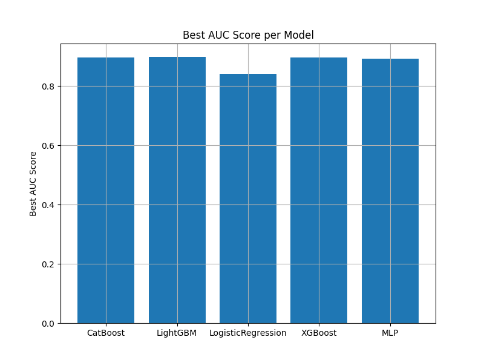
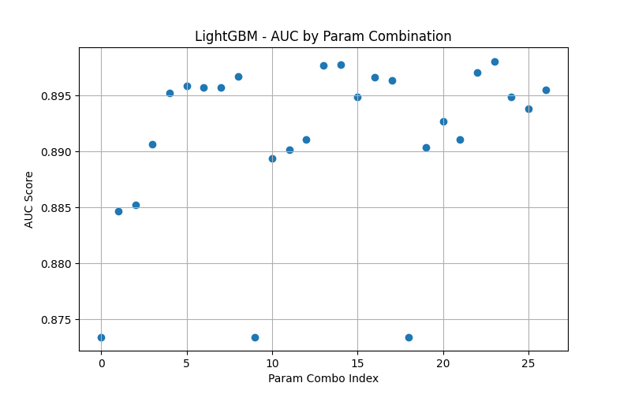
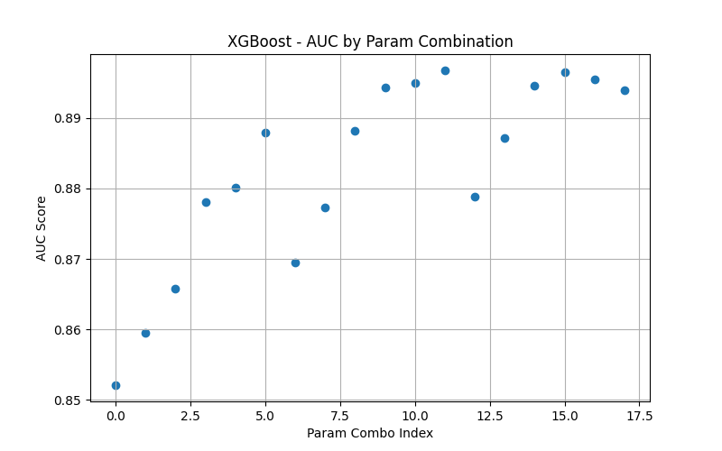
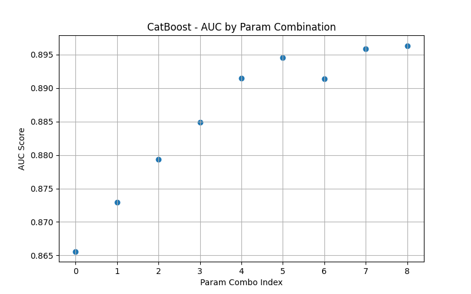
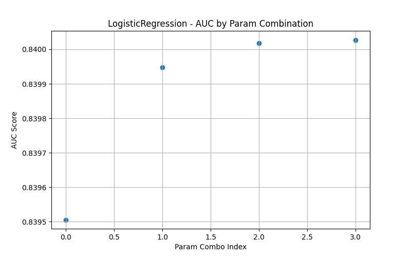
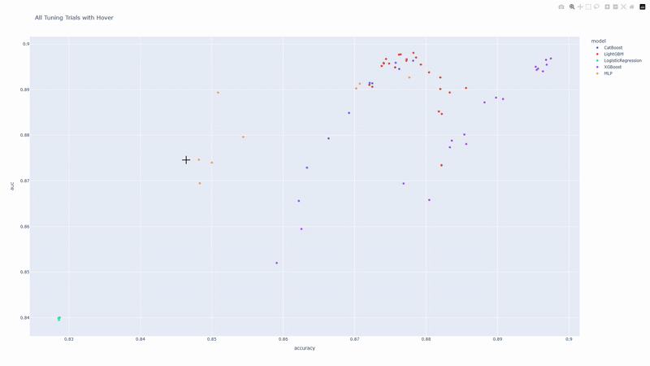
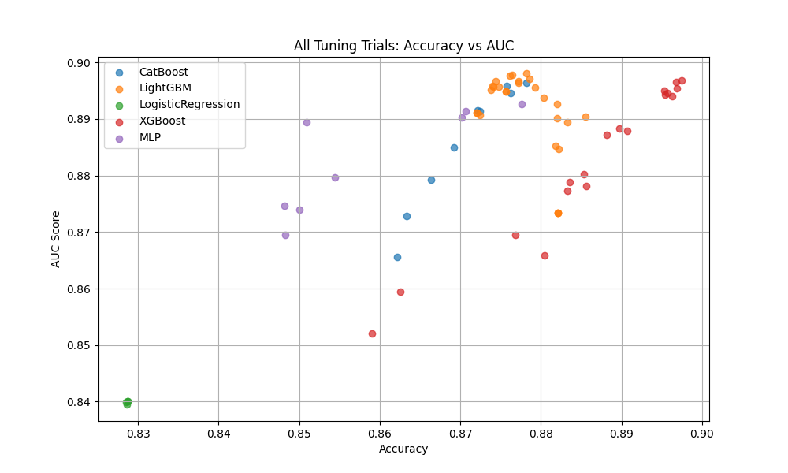
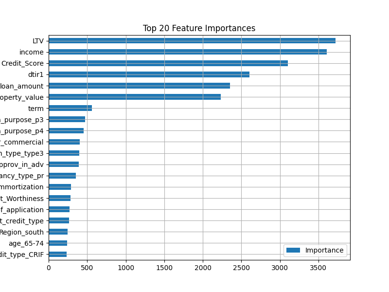

# The Group Project - Machine Learning in Trading and Finance
___
Topic: Prediction of Loan Default Risk Based on Machine Learning
___
## Inroduction
data file: data/Loan_Default/Loan_Default.csv（https://www.kaggle.com/datasets/yasserh/loan-default-dataset/data）

## Methodology
### Model selection
在“**贷款违约风险预测（Prediction of Loan Default Risk）**”这个任务中，我们面对的是一个**结构化表格数据上的二分类问题**（是否违约：0 or 1），目标是**精准预测高风险客户**。这类问题是金融风控中的经典场景。

---

#### ✅ **推荐的模型**

以下是业界、比赛和生产环境中都表现优秀、常用的模型：

| 模型名称        | 特点                                              | 是否推荐 |
|-----------------|---------------------------------------------------|----------|
| **LightGBM**     | 微软提出的 GBDT 优化版，速度快、性能强、适合大数据 | ⭐⭐⭐⭐⭐ 推荐 |
| **XGBoost**      | 最知名的 GBDT 实现，Kaggle 比赛常胜将军           | ⭐⭐⭐⭐     |
| **CatBoost**     | Yandex 提出的，天然支持类别变量                   | ⭐⭐⭐⭐     |
| **Random Forest**| 多个决策树的集合，稳定，抗过拟合                  | ⭐⭐⭐      |
| **Logistic Regression** | 基线模型，结果可解释性强（金融领域常用）    | ⭐⭐⭐      |
| **MLP（多层感知机）**   | 深度学习模型，需大量调参，适合复杂非线性     | ⭐⭐       |
| **SVM**          | 非常强的分类器，但在大数据上速度慢               | ⭐        |

---

#### 🧠 **模型选择建议**

1. **强烈建议作为主力模型：LightGBM**
   - 高效支持缺失值、类别变量（支持 `categorical_feature` 参数）
   - 自动特征选择
   - 训练快，预测也快
   - 可以处理不平衡数据

    ```python
    from lightgbm import LGBMClassifier
    
    model = LGBMClassifier(random_state=42)
    model.fit(X_train, y_train)
    ```

---

2. **XGBoost**
- 如果你希望对结果进行解释、调参细致，XGBoost 也很优秀
    ```python
    from xgboost import XGBClassifier
    
    model = XGBClassifier(random_state=42)
    model.fit(X_train, y_train)
    ```
---

3. **Logistic Regression**
- 若你对可解释性有强要求（比如银行风控需要“为什么客户被拒贷”） 可以输出系数、进行概率判断
    ```python
    from sklearn.linear_model import LogisticRegression
    
    model = LogisticRegression()
    model.fit(X_train, y_train)
    ```
---

#### ⚠️ 注意事项

数据不平衡问题（违约往往是少数）
- 如果你的标签中 `违约（Status=1）` 占比很少：
    - 可能要使用 `class_weight='balanced'` 参数
    - 或进行**上采样 / 下采样**
    - 或用 `SMOTE`（合成少数样本）

---

#### 📊 模型评估建议

仅仅看 `accuracy` 并不够，你还应该关注：

| 指标          | 含义                                     |
|---------------|------------------------------------------|
| **AUC-ROC**   | 衡量模型识别正负样本能力                 |
| **Precision** | 精确率，预测为违约中真正违约的比例       |
| **Recall**    | 召回率，所有违约中被模型识别的比例       |
| **F1-score**  | Precision 和 Recall 的调和平均           |
| **Confusion Matrix** | 真阳、假阳、真阴、假阴的具体数量  |

---

####  🧪 模型对比建议：

可以统一框架来跑多个模型对比（比如用 `sklearn` 或 `PyCaret`、`MLFlow`）

---

####  🎯 总结：建议使用路径

| 优先顺序 | 模型            | 适用场景                 |
|----------|------------------|--------------------------|
| 1        | LightGBM         | 默认首选，性能+速度兼顾 |
| 2        | XGBoost          | 高可控性、比赛常用       |
| 3        | CatBoost         | 类别变量多时很有优势     |
| 4        | LogisticRegression | 需要强解释性时使用     |

---
#### Problems
非常好，你给出的这三列：

1. `rate_of_interest`（贷款利率）  
2. `Interest_rate_spread`（贷款利率与基准利率之间的差额）  
3. `Upfront_charges`（贷款前期费用）

和目标变量**高度相关**，那我们可以从两个关键角度判断怎么处理它们：

---

🔍 一、这些变量是否属于信息泄露？

你需要先判断：**在预测目标时（例如：贷款是否违约），这些变量是否是“提前可知”的？**

| 变量名 | 是否在放贷前已知 | 是否可能导致信息泄露 |
|--------|------------------|----------------------|
| `rate_of_interest` | ✅ 通常审批时就定了 | ❌ 不泄露 |
| `Interest_rate_spread` | ✅ 可由利率 - 基准利率计算 | ❌ 不泄露 |
| `Upfront_charges` | ✅ 合同签订时就确定 | ❌ 不泄露 |

👉 **结论**：这三个变量不是“事后变量”，属于可在预测时使用的“真实特征”，**没有信息泄露风险**，可以放心使用。

---

🧠 二、它们为什么高度相关？

这三列其实是**金融属性高度耦合的体现**，它们彼此也很可能高度相关（比如利率越高，spread 通常也大，upfront 费用也可能多）：

- `Interest_rate_spread = rate_of_interest - 基准利率`，说明这两个强相关是必然的。
- `Upfront_charges` 和利率之间在很多金融产品中也有协同设计，比如低利率的贷款可能会收取更高的前期费用。

### 🤯 潜在问题：多重共线性
虽然这些特征对模型可能有帮助，但**高度线性相关的多个变量会影响解释性模型（如线性回归、逻辑回归）**。

---

✅ 建议处理方式

| 目标 | 建议 |
|------|------|
| 提高模型准确率（比如 XGBoost、随机森林、神经网络） | ✅ **保留所有这三列**，让模型自行判断权重 |
| 构建逻辑回归等需要良好解释性的模型 | ⚠️ 可考虑只保留 `rate_of_interest`，或者进行主成分分析（PCA）降维 |
| 担心共线性 | ⚠️ 可以删掉一个，比如 `Interest_rate_spread`（因它可由前者推得） |

---

## 💡 Bonus：特征工程建议
你还可以构造一个新变量，如：

```python
df['rate_to_upfront_ratio'] = df['rate_of_interest'] / (df['Upfront_charges'] + 1)
```

作为一个贷款“综合成本压力”指标，可能更有助于模型理解。

---

### ✅ 总结一下你的选择路径：

| 情况 | 是否保留 |
|------|----------|
| 目标是准确率，模型是树模型/神经网络 | ✔️ 保留 |
| 模型是逻辑回归/解释性要求高 | ⚠️ 保留一两个变量或做PCA |
| 三列之间也强相关（高共线） | ⚠️ 可去掉推导列如 `Interest_rate_spread` |

---

### Evaluation Metrics
本项目采用以下五项常见的分类性能指标来全面评估模型在贷款违约预测任务中的表现：
####  1. Accuracy（准确率）
表示模型预测正确的样本数在总样本数中的比例
####  2. Precision（精确率）
表示被模型预测为“违约”的样本中，实际真的违约的比例。适合关注“预测为正”的准确性场景。
####  3. Recall（召回率）/ Sensitivity（敏感度）
####  4. F1 Score（调和平均值）
F1 是 Precision 和 Recall 的调和平均，是一种在不平衡数据中常用的综合指标：
F1 Score 越高表示模型在精度和召回之间达成了更好的平衡。
####  5. AUC-ROC（Area Under the ROC Curve）
AUC 衡量模型在各种阈值下对样本排序的能力，
- AUC 越接近 1 越好；
- AUC = 0.5 表示随机猜测。

### Results

#### 🔢 Model Performance Summary

| Model              | Best AUC Score | Best Parameters                                      |
|-------------------|----------------|------------------------------------------------------|
| **LightGBM**       | 0.8981         | `{'num_leaves': 128, 'learning_rate': 0.05, 'max_depth': -1}` |
| **XGBoost**        | 0.8968         | `{'learning_rate': 0.05, 'max_depth': 10, 'n_estimators': 200}` |
| **CatBoost**       | 0.8964         | `{'learning_rate': 0.1, 'depth': 8}`                |
| **MLP**            | 0.8927         | `{'batch_size': 64, 'lr': 0.001, 'epochs': 15}`     |
| **LogisticRegression** | 0.8400         | `{'C': 10.0}`                                        |

> 🔥 **Best overall model**: **LightGBM** with AUC = **0.8981**

---

#### 📈 Performance Comparison (AUC)



---

#### ⚙️ Parameter Tuning Results (AUC by Param Combination)

- **LightGBM**  
  

- **XGBoost**  
  

- **CatBoost**  
  

- **MLP**  
  

- **Logistic Regression**  
  

---

#### 📊 Accuracy vs AUC of All Trials

- **Interactive Hover Plot (Plotly)**  
  

- **Static Comparison Plot**  
  

---

#### 🔍 Top 20 Feature Importances (LightGBM)



重点特征包括：
- `LTV`, `income`, `Credit_Score`, `dtir1`, `loan_amount`, `property_value`
- 这些变量在贷款违约风险预测中具有显著的解释力。

---


### Work
- 模型实现
- 前后端可视化
- PPT + 演讲
- Report （后置）