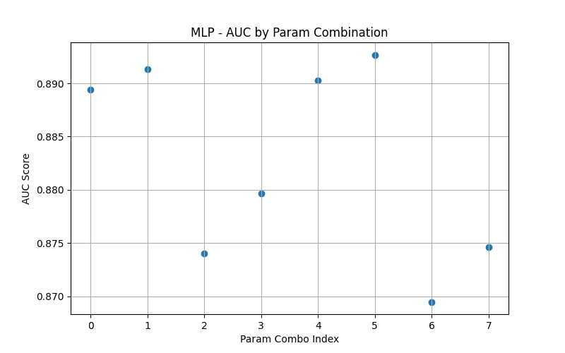

# The Group Project - Machine Learning in Trading and Finance
___
Topic: Prediction of Loan Default Risk Based on Machine Learning
___
## Inroduction
data file: data/Loan_Default/Loan_Default.csv（https://www.kaggle.com/datasets/yasserh/loan-default-dataset/data）

## Methodology
### Model selection
在“**贷款违约风险预测（Prediction of Loan Default Risk）**”这个任务中，我们面对的是一个**结构化表格数据上的二分类问题**（是否违约：0 or 1），目标是**精准预测高风险客户**。这类问题是金融风控中的经典场景。

---

#### ✅ **推荐的模型**

以下是业界、比赛和生产环境中都表现优秀、常用的模型：

| 模型名称        | 特点                                              | 是否推荐 |
|-----------------|---------------------------------------------------|----------|
| **LightGBM**     | 微软提出的 GBDT 优化版，速度快、性能强、适合大数据 | ⭐⭐⭐⭐⭐ 推荐 |
| **XGBoost**      | 最知名的 GBDT 实现，Kaggle 比赛常胜将军           | ⭐⭐⭐⭐     |
| **CatBoost**     | Yandex 提出的，天然支持类别变量                   | ⭐⭐⭐⭐     |
| **Logistic Regression** | 基线模型，结果可解释性强（金融领域常用）    | ⭐⭐⭐      |
| **MLP（多层感知机）**   | 深度学习模型，需大量调参，适合复杂非线性     | ⭐⭐       |
---

#### **模型选择**

| 优先顺序 | 模型            | 适用场景                 |
|----------|------------------|--------------------------|
| 1        | LightGBM         | 默认首选，性能+速度兼顾 |
| 2        | XGBoost          | 高可控性、比赛常用       |
| 3        | CatBoost         | 类别变量多时很有优势     |
| 4        | LogisticRegression | 需要强解释性时使用     |
| 5        | MLP（神经网络）    | 复杂非线性问题           |

#### 注意事项

数据不平衡问题（违约往往是少数）
- 标签中 `违约（Status=1）` 占比很少：
    - 我们使用 `class_weight='balanced'` 参数
---
#### Problems
此三列：
1. `rate_of_interest`（贷款利率）  
2. `Interest_rate_spread`（贷款利率与基准利率之间的差额）  
3. `Upfront_charges`（贷款前期费用）

和目标变量**高度相关**。
经过分析，我们发现

| 变量 | 缺失行为 | 是否泄露 |
|------|---------|-----------|
| `Interest_rate_spread` | **违约时总是 NaN**，不违约时从不 NaN | ✅ **强烈信息泄露** |
| `rate_of_interest` | 类似于上面，和目标变量几乎同步缺失 | ✅ 信息泄露 |
| `Upfront_charges` | 同样行为 | ✅ 信息泄露 |
| `Property_value`, `LTV`, `dtir1` | 在违约贷款中缺失较多，非违约中几乎都不缺 | ⚠️ 弱信息泄露 |
这揭示了**一个非常严重的问题**：  
> 数据集中，某些变量的“缺失值”**直接暗示了目标值**，这其实是一种**信息泄露的形式**。

---

##### 问题核心：NaN = isDefaulted 的信号

例如只写：

```python
X['missing_spread'] = X['Interest_rate_spread'].isnull()
```
然后用它作为特征训练模型，模型就能“100%准确”地预测违约情况，完全**不是因为理解了业务逻辑**，而是**利用了标签本身的泄露线索**。

提出问题，那如果直接填补缺失再训练？
用平均值、中位数或者回归填补这些缺失值不就好了吗

**其实不行。**  
因为这个缺失不是“正常的缺失”，而是**标签造成的缺失（Target-induced Missingness）**，这种缺失不是随机的（不是 Missing At Random），而是跟 `loan_default` 强相关的（甚至是决定性的）。


**训练模型时**，应当删除这几个泄露变量：

| 特征名 | 推荐操作 |
|--------|----------|
| `Interest_rate_spread` | ❌ 删除 |
| `rate_of_interest` | ❌ 删除 |
| `Upfront_charges` | ❌ 删除 |


这样做可以避免模型“利用缺失当答案”，更接近真实业务场景中预测违约的能力。

---

### Evaluation Metrics

| Metric               | Meaning                  |
|----------------------|--------------------------|
| **AUC-ROC**          | 衡量模型识别正负样本能力             |
| **Precision**        | 精确率，预测为违约中真正违约的比例        |
| **Recall**           | 召回率，所有违约中被模型识别的比例        |
| **F1-score**         | Precision 和 Recall 的调和平均 |
| **Confusion Matrix** | 真阳、假阳、真阴、假阴的具体数量         |
本项目采用以下五项常见的分类性能指标来全面评估模型在贷款违约预测任务中的表现：
####  1. Accuracy（准确率）
表示模型预测正确的样本数在总样本数中的比例
####  2. Precision（精确率）
表示被模型预测为“违约”的样本中，实际真的违约的比例。适合关注“预测为正”的准确性场景。
####  3. Recall（召回率）/ Sensitivity（敏感度）
####  4. F1 Score（调和平均值）
F1 是 Precision 和 Recall 的调和平均，是一种在不平衡数据中常用的综合指标：
F1 Score 越高表示模型在精度和召回之间达成了更好的平衡。
####  5. AUC-ROC（Area Under the ROC Curve）
AUC 衡量模型在各种阈值下对样本排序的能力，
- AUC 越接近 1 越好；
- AUC = 0.5 表示随机猜测。

### Results

#### 🔢 Model Performance Summary

| Model              | Best AUC Score | Best Parameters                                      |
|-------------------|----------------|------------------------------------------------------|
| **LightGBM**       | 0.8981         | `{'num_leaves': 128, 'learning_rate': 0.05, 'max_depth': -1}` |
| **XGBoost**        | 0.8968         | `{'learning_rate': 0.05, 'max_depth': 10, 'n_estimators': 200}` |
| **CatBoost**       | 0.8964         | `{'learning_rate': 0.1, 'depth': 8}`                |
| **MLP**            | 0.8927         | `{'batch_size': 64, 'lr': 0.001, 'epochs': 15}`     |
| **LogisticRegression** | 0.8400         | `{'C': 10.0}`                                        |

> 🔥 **Best overall model**: **LightGBM** with AUC = **0.8981**

---

#### 📈 Performance Comparison (AUC)


---

#### ⚙️ Parameter Tuning Results (AUC by Param Combination)

- **LightGBM**  
  

- **XGBoost**  
  

- **CatBoost**  
  

- **MLP**  
  

- **Logistic Regression**  
  

---

#### 📊 Accuracy vs AUC of All Trials

- **Interactive Hover Plot (Plotly)**  
  

- **Static Comparison Plot**  
  

---

#### 🔍 Top 20 Feature Importances (LightGBM)


重点特征包括：
- `LTV`, `income`, `Credit_Score`, `dtir1`, `loan_amount`, `property_value`
- 这些变量在贷款违约风险预测中具有显著的解释力。

---